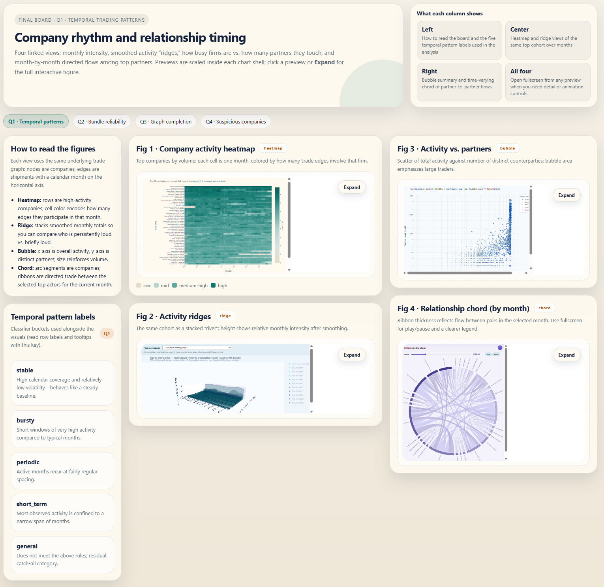
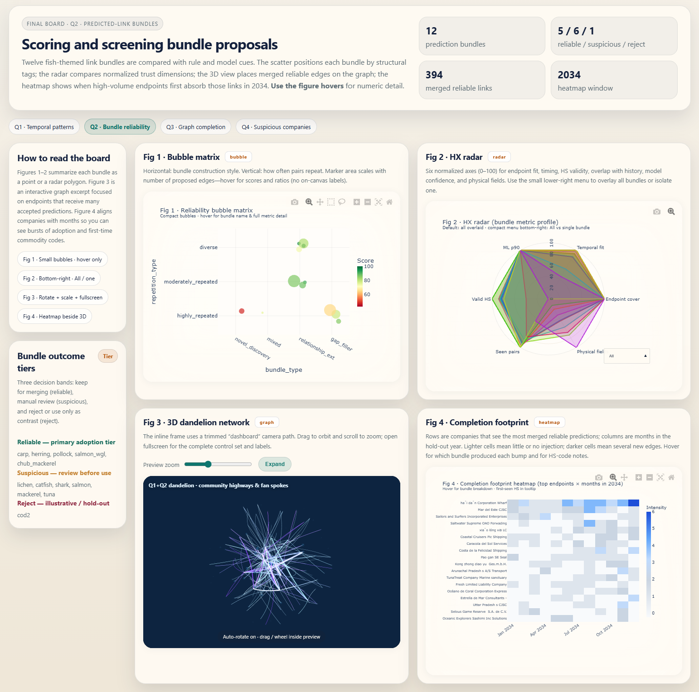
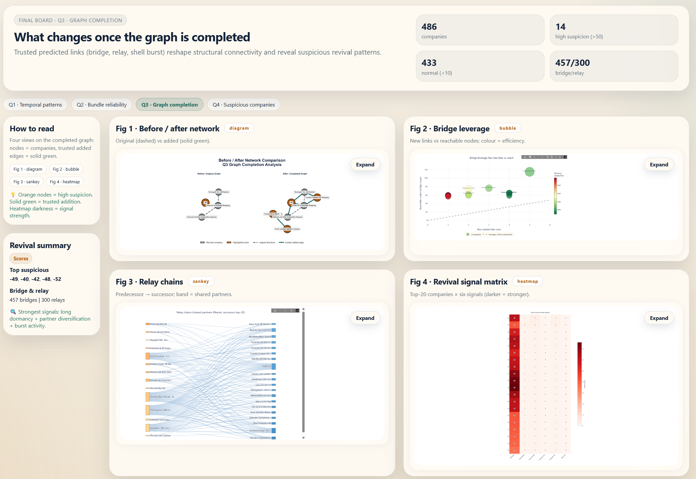
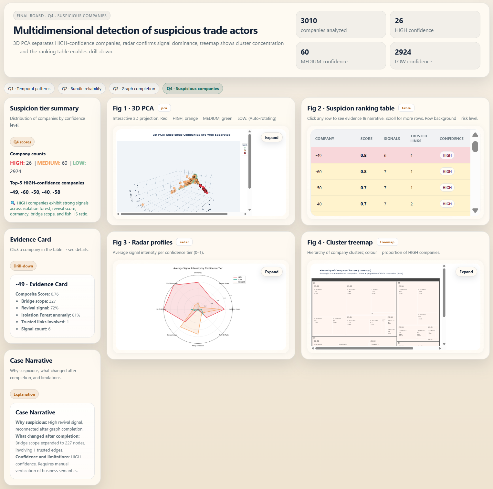

# Oceanus trade graph — VAST Challenge 2023 Mini-Challenge 2

Course project (HKUST MSBD5005) on the **Oceanus** maritime trade **knowledge graph**: analysts use **visual analytics** to compare companies over time, judge **predicted link bundles**, spot **structural change** after trusted links are merged, and highlight firms whose patterns warrant attention regarding **IUU (illegal, unreported, and unregulated) fishing**.

**Task source:** [VAST Challenge 2023 — Mini-Challenge 2](https://vast-challenge.github.io/2023/MC2.html) (problem statement, word/image limits, and submission rules). This repository targets **Questions 1–4**; **Question 5** (reflection) is written text for the submission, not code here.

---

## Dashboard boards (Q1–Q4)

PNG snapshots of the four submission-facing boards. Paths are **relative to this file** at the repo root (`./dashboard/…`). They summarise the storyline; methodological detail is in **[analysis/README.md](analysis/README.md)** and figure semantics in **[visualization/README.md](visualization/README.md)**.

**GitHub / git:** the README only embeds files that exist **on the remote branch**. If `dashboard/*.png` are not committed and pushed, the online README will show broken image icons—run `git add dashboard/` and commit. Local Markdown preview should open the repo (or this file) from the **project root** so `./dashboard/` resolves.

### Q1 · Temporal patterns



### Q2 · Bundle reliability



### Q3 · Post-link anomalies



### Q4 · Suspicion & structure



---

## What this repository does

Per the MC2 brief:

1. **Q1** — Characterise **temporal patterns** for companies and pairwise relationships.
2. **Q2** — **Evaluate twelve predicted-link bundles** and decide what is safe for graph completion.
3. **Q3** — Surface **new patterns or anomalies** after inserting the reliable links from Q2.
4. **Q4** — **Flag candidate companies** and explain confidence using linked evidence.

Rough scale: ~**5.4M** trade edges plus **twelve** bundle files. Thresholds and paths live in **`analysis/shared/config.py`**.

---

## Prerequisites and installation

- **Python** 3.10 or newer recommended.
- Clone the repo, then install dependencies:

```bash
pip install -r requirements.txt
```

(Optional) Create a virtual environment first (`python -m venv .venv` then activate it). If you rely on **conda**, create/use an env (e.g. named `dv`) and run the same `pip install -r requirements.txt` inside it. On Windows, if **`conda run`** prints encoding errors when piping stdout, run `python` from an activated shell or switch the console code page (`chcp 65001`) before using `conda run`.

---

## Raw data (`MC2/`)

The challenge files are **not** committed. At the repository root, create **`MC2/`** and place:

```
MC2/
├── mc2_challenge_graph.json   # primary knowledge graph
└── bundles/                     # twelve predicted-link bundles
```

Paths are defined in **`analysis/shared/config.py`**. After this step, **`analysis/run_pipeline.py`** can load the graph.

---

## Run the analysis pipeline

From the repo root (with your interpreter that has dependencies installed):

```bash
python analysis/run_pipeline.py
```

This computes Q1→Q4 and writes CSV/JSON under **`outputs/q1`** … **`outputs/q4`**. **[outputs/README.md](outputs/README.md)** documents each artefact.

---

## Build figures (visualization)

Scripts read **`outputs/`** only—they **do not** read `MC2/` directly. Run the pipeline above first unless you already have compatible exports.

Execute from repo root:

| Step | Command |
|------|---------|
| **Q1** (bubble, ridge, chord data, monthly heatmap) | `python visualization/q1/build_q1_bubble_scatter.py`<br>`python visualization/q1/build_q1_ridge_river.py`<br>`python visualization/q1/build_q1_relationship_chord_data.py`<br>`python visualization/q1/build_q1_monthly_heatmap.py` |
| **Q2** (orchestrates scripts that exist locally) | `python visualization/q2/build_q2_figures.py` |
| **Q3** | `python visualization/q3/build_q3_figures.py` |
| **Q4** | `python visualization/q4/build_q4_figures.py` |

Plots and HTML land mainly under **`visualization/figures_2d/`** and **`visualization/figures_3d/`**. Open generated `.html` in a browser; see **[visualization/README.md](visualization/README.md)** for encoding intent.

---

## Story boards (`final_sketches/`)

Static **HTML** dashboards (`q1.html` … `q4.html`) that bundle the narrative for each question—they expect the regenerated assets to exist beside them or under `visualization/`. **Open the files in a browser** (double-click or “Open with…”); there is **no README** inside that folder. Regenerate visuals with the commands above after changing data or thresholds.

---

## Repository layout

| Path | Role |
|------|------|
| **[analysis/](analysis/README.md)** | Pipeline code: indexing, bundle scoring & merge, anomalies, clustering, suspicion synthesis. **`run_pipeline.py`** is the main entry. |
| **[outputs/](outputs/README.md)** | Pipeline exports consumed by viz and summaries. |
| **[visualization/](visualization/README.md)** | Plot builders (`visualization/q1` … `q4`). |
| **`MC2/`** | Local-only raw challenge files (you create this). |
| **`final_sketches/`** | Q1–Q4 story HTML boards (browser-open). |
| **`dashboard/`** | PNG thumbnails shown at the top of this README. |
| **`phase1_sketches/`** | Early prototypes, not tied to production runs. |